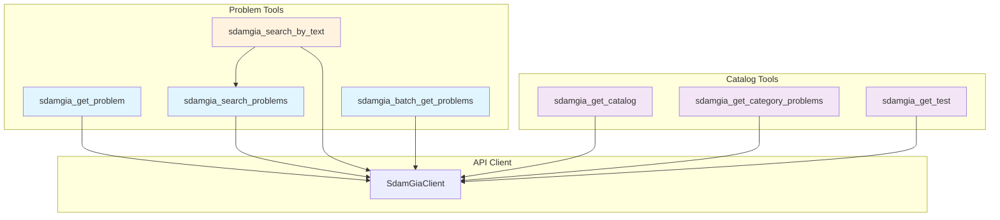
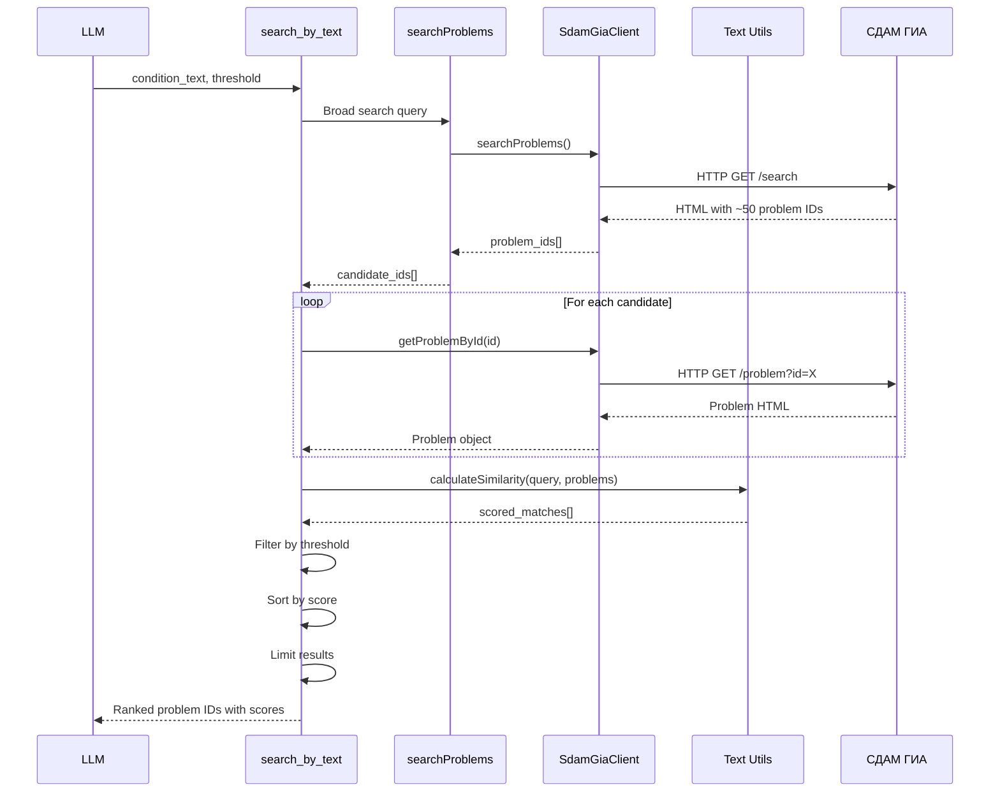
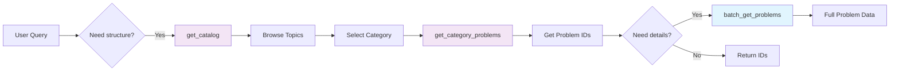
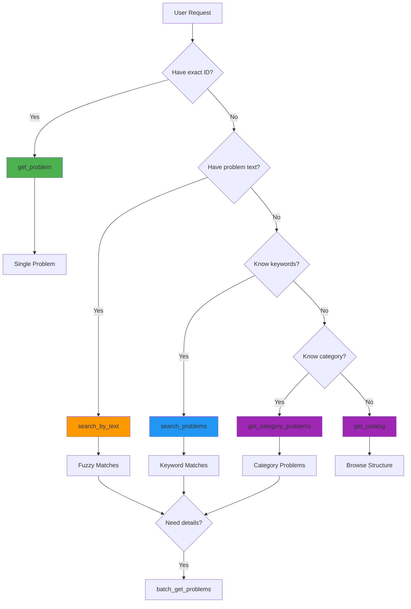
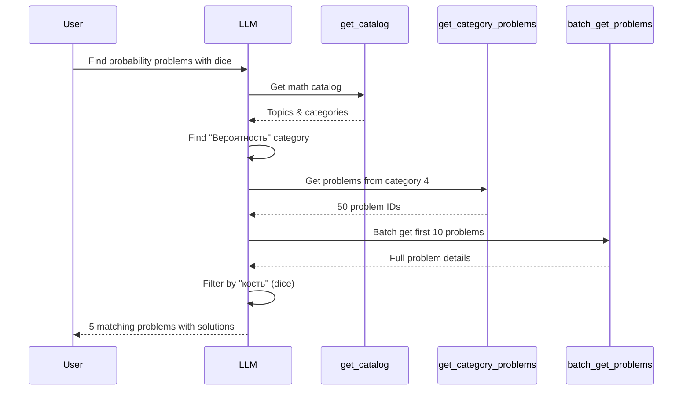
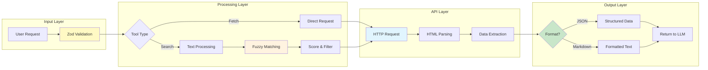
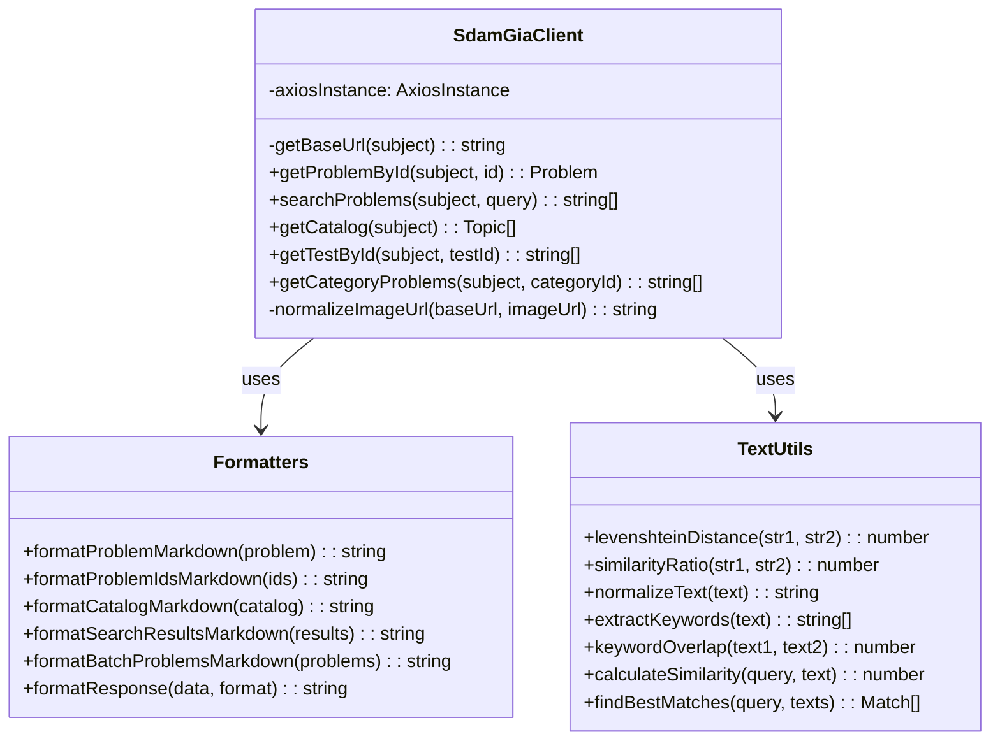
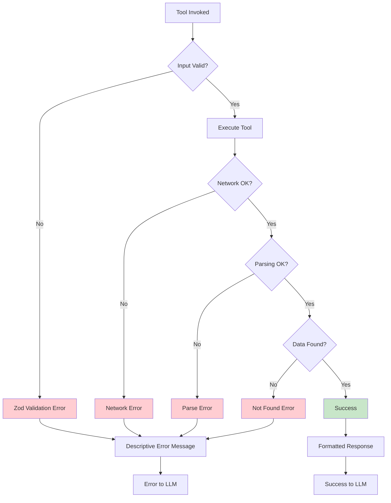
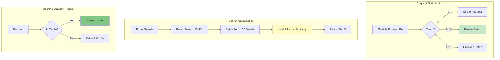
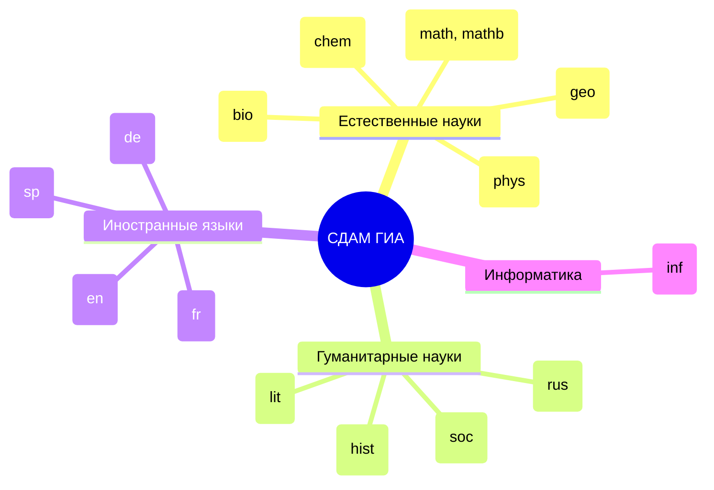

# СДАМ ГИА MCP Server - Tool Flow Diagrams

## Tool Overview

## Fuzzy Search Flow

## Catalog Exploration Flow

## Search Strategy Decision Tree

## Tool Composition Example

## Data Processing Pipeline

## API Client Architecture

## Error Handling Flow

## Performance Optimization

## Tool Selection Matrix

| Use Case | Tool | Complexity | Requests |
|----------|------|------------|----------|
| Known ID | `get_problem` | Low | 1 |
| Keyword search | `search_problems` | Low | 1 |
| Text matching | `search_by_text` | High | 31-51 |
| Multiple IDs | `batch_get_problems` | Medium | N (parallel) |
| Explore topics | `get_catalog` | Low | 1 |
| Topic problems | `get_category_problems` | Low | 1 |
| Test problems | `get_test` | Low | 1 |

## Subject Coverage

